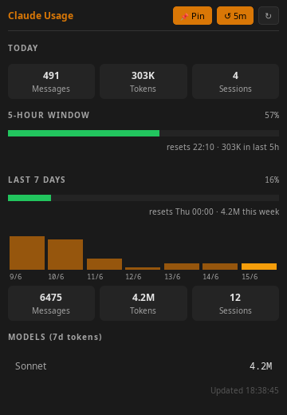

# claude-code-usage

> **Unofficial tool — not made by, affiliated with, or endorsed by Anthropic.**  
> "Claude" and the Claude logo are trademarks of Anthropic, PBC.

A lightweight PyQt6 desktop widget that shows your [Claude Code](https://claude.ai/code) token consumption at a glance — no API key required. Reads the local `~/.claude/` data written by the CLI.



**What it shows:**
- Today's messages, tokens, and sessions
- Rolling 5-hour window gauge (throttle risk indicator)
- 7-day bar chart and totals
- Per-model token breakdown (Sonnet / Opus / Haiku)
- Real rate-limit percentages when the Claude Code statusline script is running

---

## Platform support

| Platform | Status | Notes |
|---|---|---|
| Linux (X11) | ✅ Full | System tray, always-on-top |
| Linux (Wayland) | ✅ Works | See [Wayland notes](#wayland) below |
| macOS | ✅ Full | Native tray via QSystemTrayIcon |
| Windows | ✅ Full | Native tray; paths resolved via `Path.home()` |

---

## Data path

Claude Code stores its data in a `.claude` folder inside your home directory:

| OS | Path |
|---|---|
| Linux | `~/.claude/` → `/home/you/.claude/` |
| macOS | `~/.claude/` → `/Users/you/.claude/` |
| Windows | `~\.claude\` → `C:\Users\you\.claude\` |

The app uses Python's `Path.home() / ".claude"` which resolves correctly on all platforms.

---

## Install

**Prerequisites:** Python 3.10+ and [Claude Code CLI](https://claude.ai/code) used at least once (so `~/.claude/` exists).

### Linux

```bash
pip install PyQt6
python claude_usage.py
```

If `pip` is externally managed (Arch, Debian 12+, Ubuntu 23+):

```bash
pip install --user PyQt6   # or: pipx run --no-cache PyQt6 ... (not ideal for a GUI app)
# Recommended: use a venv
python -m venv .venv && source .venv/bin/activate
pip install PyQt6 && python claude_usage.py
```

To add to your app launcher, copy and edit the desktop entry:

```bash
cp packaging/claude-usage.desktop ~/.local/share/applications/
nano ~/.local/share/applications/claude-usage.desktop   # fix the Exec= path
update-desktop-database ~/.local/share/applications/
```

### macOS

```bash
pip3 install PyQt6
python3 claude_usage.py
```

macOS 13+ ships with Python 3.9 but marks pip as externally managed; use Homebrew Python or a venv:

```bash
brew install python
pip3 install PyQt6
python3 claude_usage.py
```

To launch without a Terminal window, create a one-line **Automator → Shell Script** app targeting:
```
python3 /path/to/claude_usage.py
```

### Windows

```powershell
pip install PyQt6
pythonw claude_usage.py   # pythonw suppresses the console window
```

Create a desktop shortcut with target:
```
pythonw.exe C:\path\to\claude_usage.py
```

---

## Optional: real rate-limit percentages

If you run the Claude Code statusline script it writes live rate-limit data to `~/.claude/rate-limits-cache.json`. When present, the widget shows exact percentages and reset times instead of estimates.

---

## Wayland

The widget works on Wayland with no extra setup — PyQt6 auto-selects the Wayland backend when `WAYLAND_DISPLAY` is set.

```bash
QT_QPA_PLATFORM=wayland python claude_usage.py   # force Wayland
QT_QPA_PLATFORM=xcb python claude_usage.py        # force XWayland / X11
```

**Known limitations on Wayland:**
- **Always-on-top (Pin)** is silently ignored on most compositors — the window still works, the hint just has no effect.
- **System tray** requires a StatusNotifierItem-aware compositor or panel. Works on KDE Plasma; on GNOME you need the [AppIndicator extension](https://extensions.gnome.org/extension/615/appindicator-support/). The app detects unavailability gracefully (`QSystemTrayIcon.isSystemTrayAvailable()`) and skips the tray when it isn't supported.

---

## Packaging

### AppImage (Linux)

Built automatically on tagged releases via [`.github/workflows/release.yml`](.github/workflows/release.yml).  
Download from the [Releases](https://github.com/michaelpeeters/claude-code-usage/releases) page.

To build locally:

```bash
pip install PyInstaller PyQt6
pyinstaller --onedir --windowed --name claude-usage claude_usage.py
# Then use appimagetool or appimage-builder on the dist/ directory
```

### Flatpak

A manifest is provided in [`packaging/com.github.michaelpeeters.ClaudeUsage.yml`](packaging/com.github.michaelpeeters.ClaudeUsage.yml).

```bash
# Install runtime (once)
flatpak install flathub org.kde.Platform//6.9 org.kde.Sdk//6.9

# Build and install locally
flatpak-builder --install --user build-dir \
    packaging/com.github.michaelpeeters.ClaudeUsage.yml
```

> The Flatpak manifest is a starting point and has not been tested in CI yet. PRs welcome.

---

## Development

```bash
pip install PyQt6 pytest
pytest                          # local
QT_QPA_PLATFORM=offscreen pytest   # headless (same as CI)
```

CI runs on Linux (Python 3.10 – 3.13), macOS, and Windows.

---

## License

[MIT](LICENSE)
